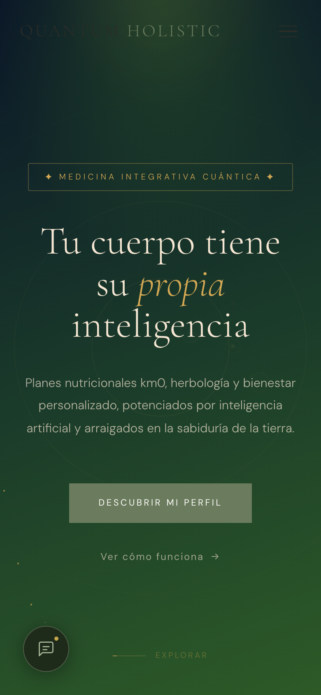
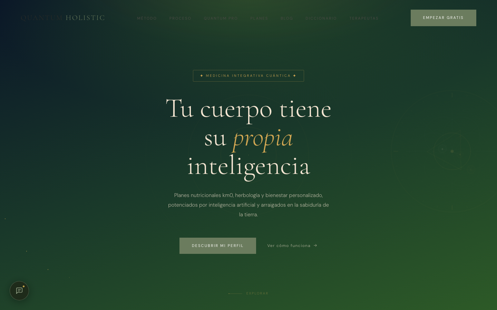
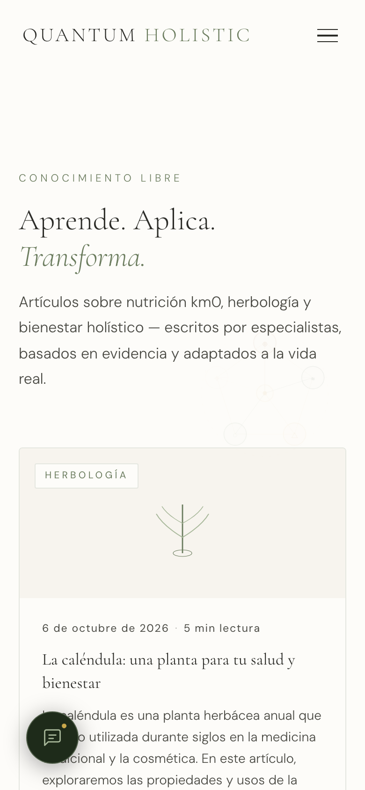
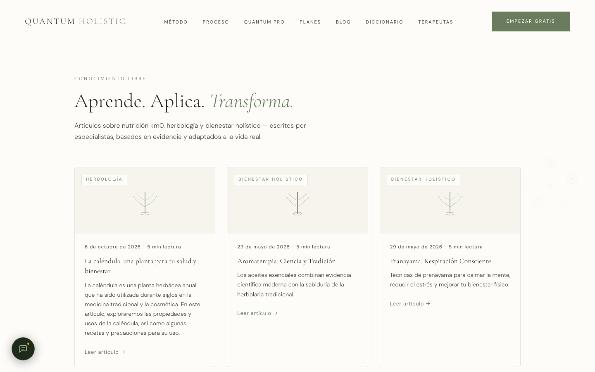
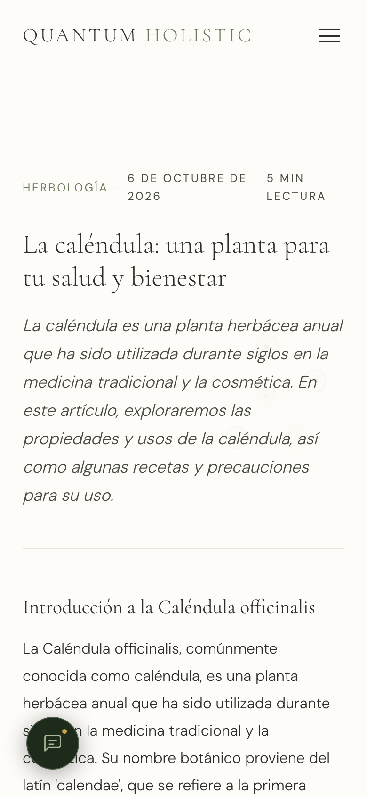
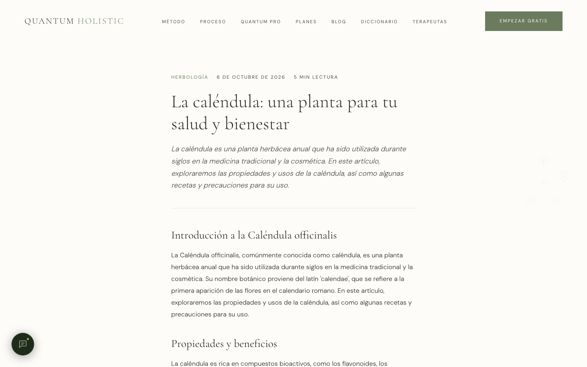
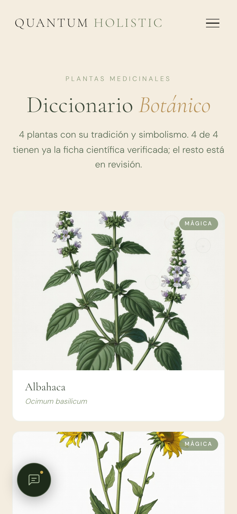
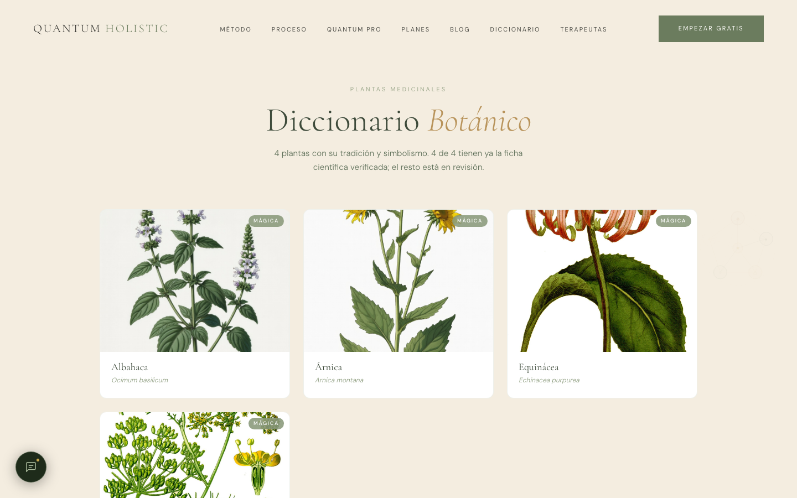
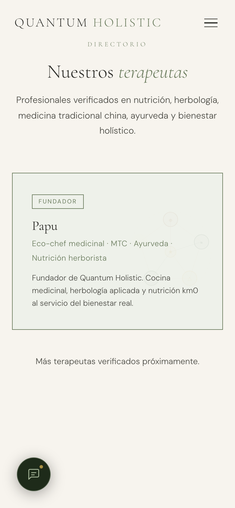
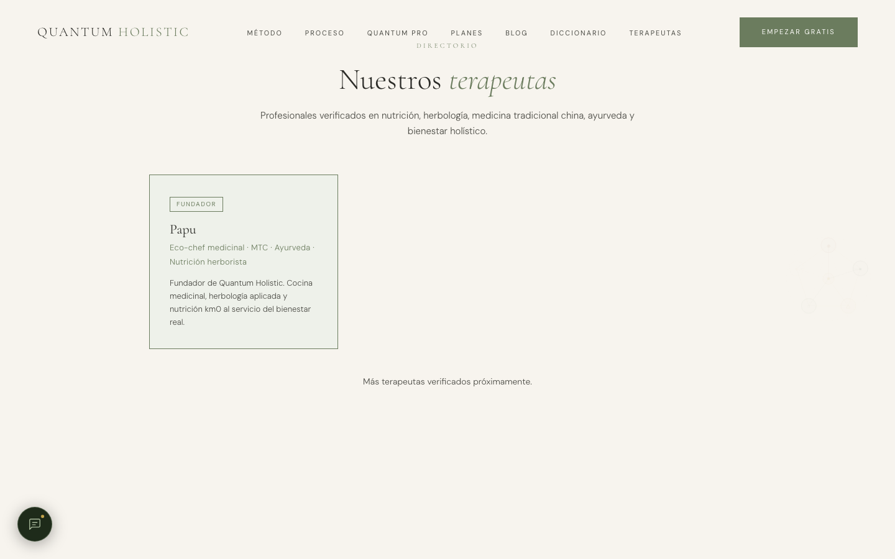

# Auditoría visual de la web — 8-oct-2026

Solo informe: **no se ha cambiado el diseño**. Método de `qh-diseno`.

**Prueba:** capturas de producción con Playwright (Chromium headless) el 8-oct ~10:40 Madrid, móvil 390×844 y
escritorio 1440×900, más medidas automáticas (scroll horizontal, toques < 44 px, texto < 14 px, imágenes rotas, alt).
Las capturas están en [`diseno/`](diseno/) (`<página>-<vista>.png` = primera pantalla; `-completa.jpg` = página entera;
la portada completa se tomó haciendo scroll para que salgan las animaciones).

> **Ojo:** las capturas son de **quantum-holistic.com**. `q-h.com` no es nuestro: es una página de venta del dominio
> (ver `incoherencias.md`).

| Página | Móvil | Escritorio |
|---|---|---|
| Inicio |  |  |
| Blog |  |  |
| Un post (caléndula) |  |  |
| Diccionario |  |  |
| Terapeutas |  |  |

Lo que está bien: las 10 vistas responden 200, **sin scroll horizontal**, 0 imágenes rotas, 0 imágenes sin `alt`,
1 solo H1 por página, y las fuentes de marca (Cormorant Garamond + DM Sans) cargan en todas.

## Los 10 problemas visuales más graves (de más a menos)

1. **Cifras y testimonios que no se pueden sostener (portada).** "2.400+ planes km0 generados", "98 % satisfacción",
   "340+ plantas en la base de datos", "< 48 h", y 3 testimonios con nombre y ciudad. Hoy hay 52 plantas (4 visibles),
   0 leads y 1 perfil. Es el problema de confianza (y legal: publicidad engañosa) más serio de la web.
2. **La portada no tiene ni una imagen de marca.** Es un degradado verde-negro con líneas finas; la estética de
   acuarela botánica (crema, salvia, dorado, mucho aire) no aparece hasta el diccionario. Primera impresión: app
   "tech/cuántica", no herbolario.
3. **Logo y menú casi invisibles sobre el héroe oscuro.** "QUANTUM" sale verde oscuro sobre verde oscuro y los enlaces
   del menú de escritorio y el icono de menú móvil tienen un contraste muy por debajo de AA (4,5:1).
4. **Posibles imágenes de especie equivocada en el diccionario.** La lámina de *Árnica* parece un girasol/Helianthus
   (tallo alto con hojas opuestas dentadas) y la de *Equinácea* muestra pétalos naranja-rojos curvados tipo lirio, no
   la flor rosa-púrpura de *Echinacea purpurea*. Además las flores salen **cortadas por arriba** en la tarjeta. A verificar por Kristian. Lo mismo en las 5 fichas sin publicar: `valeriana-cientifica.jpg` es un árbol con flores lilas, `jengibre` un abedul, `salvia` una cúrcuma en flor, `tomillo` una rastrera que no es tomillo; `lavanda` no tiene archivo.
5. **El blog y los posts no tienen imagen.** La tarjeta del blog muestra un icono de línea genérico y el post abre con
   texto sin portada: nada invita a leer, y en redes se comparte sin imagen atractiva.
6. **Héroes con aire vacío excesivo en móvil.** Inicio, blog y post pierden ~300 px arriba antes del contenido; en el
   post, la meta (categoría · fecha · lectura) se parte en 2–3 líneas descolocadas.
7. **Mensajes "cuánticos" en primer plano** ("Medicina integrativa cuántica", "Tecnología cuántica aplicada…"): chocan
   con la línea editorial (`qh-editorial` deja fuera la nutrición cuántica) y restan credibilidad.
8. **Objetivos táctiles pequeños:** 15–44 enlaces/botones por página miden menos de 44 px (enlaces del menú, etiquetas,
   "Ver cómo funciona", pie). El botón de chat flotante tapa texto del primer párrafo en móvil (blog y post).
9. **Mezcla de bloques oscuros y claros sin ritmo** en la portada (verde noche → crema → verde noche → crema) y una
   ventana emergente ("El Romero Silvestre…") que aparece sobre el contenido al llegar al final.
10. **Páginas con poco contenido que parecen vacías:** terapeutas tiene 1 ficha y mucho blanco; el diccionario dice
    "4 plantas" en grande; las etiquetas "MÁGICA" en todas las tarjetas no explican nada al visitante.

(Texto < 14 px: 79 elementos en la portada —cintas y cifras—, 2–4 en el resto.)

## 2–3 direcciones visuales (acuarela de marca)

Todas usan solo los tokens de `globals.css` (`--sage`, `--cream`, `--gold`, `--earth`, `--charcoal`) y las dos
fuentes actuales. Ninguna toca el embudo de pago.

### A. "Herbario abierto" (la recomendada)
- Fondo **crema** en toda la web (adiós al héroe verde noche); el héroe es una **lámina de acuarela grande** de una
  planta de temporada, semitraslúcida, a sangre por la derecha, con el titular en `--charcoal`.
- Tarjetas de blog y diccionario con la **misma lámina** (generada con `kimiko-imagen`, `tipo: cientifica`), marco fino
  `--sage-light`, nombre latino en cursiva.
- Dorado solo en filetes y números de sección. Encaja con lo que ya funciona (el diccionario) y lo extiende.

### B. "Cuaderno de campo"
- Crema + manchas de acuarela salvia/tierra **detrás** de los títulos (como aguadas), anotaciones a mano mínimas
  (flechas, subrayados) en `--earth`.
- Más editorial: cada post abre con una franja de acuarela horizontal y una "ficha rápida" (parte usada, familia,
  precauciones) en caja crema.
- Más cálido y personal; algo más de trabajo de imagen.

### C. "Noche botánica" (conserva el verde oscuro)
- Mantiene `--pro-dark` solo en el héroe y la sección Pro, pero con una **acuarela clara y luminosa** sobre él y el
  logo/menú en `--cream` para arreglar el contraste.
- Resto de la web en crema. Es el cambio más pequeño, pero sigue alejando la portada del resto.

## Siguiente paso propuesto
Kristian elige A, B o C. Después: PR pequeño solo de la portada (héroe + cabecera), con capturas antes/después de la
vista previa de Vercel y Lighthouse sin empeorar. Las cifras y testimonios (punto 1) se pueden quitar ya, sin esperar
al rediseño, si Kristian da el sí.
